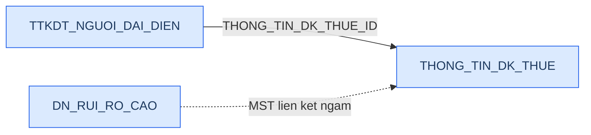
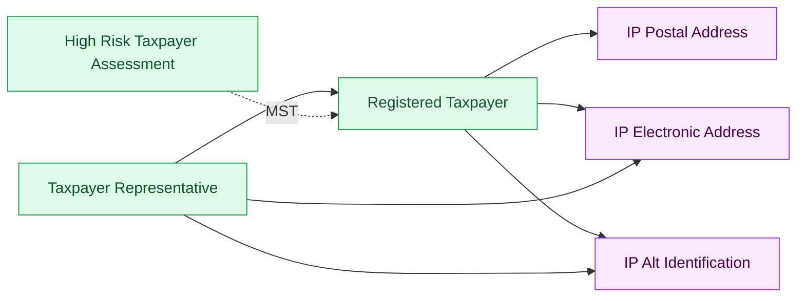
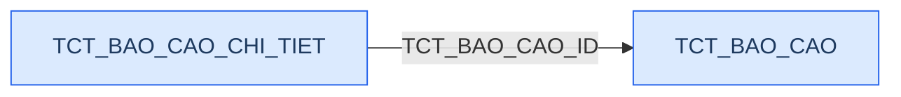
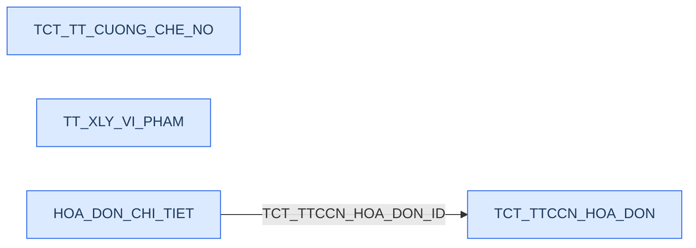
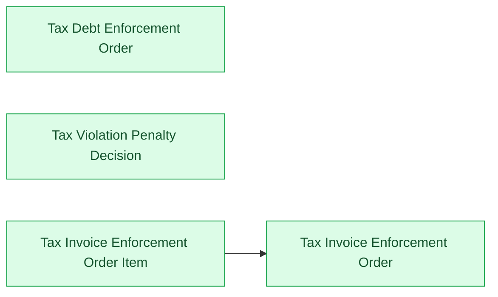

# DCST — Relationship Diagram: Source vs Silver Proposed Model

> **He thong nguon:** DCST (Du lieu Co quan Thue — Tong cuc Thue)
> **Domain:** Thong tin dang ky thue, bao cao tai chinh, cuong che no thue, xu ly vi pham thue
> **Ngay:** 09/04/2026
>
> **Render:** Mo file nay trong VS Code voi extension **Markdown Preview Mermaid Support**, hoac dan tung block vao [mermaid.live](https://mermaid.live).
>
> **Ky hieu:**
> - Mui ten lien (-->): quan he FK (Many to One)
> - Mui ten dut (-.->): lien ket ngam qua MST (khong co FK khai bao)
> - Xanh duong: bang nguon DCST
> - Xanh la: entity Silver
> - Tim: Shared entity (dung chung cho moi Involved Party)

---

## Nhom 1 — Taxpayer Registration (To chuc/DN dang ky thue)

### Source (DCST)

> **Lien ket thuc te:**
> - `TTKDT_NGUOI_DAI_DIEN.THONG_TIN_DK_THUE_ID` → FK thuc den `THONG_TIN_DK_THUE.ID`
> - `DN_RUI_RO_CAO.MA_SO_DOANH_NGHIEP` ↔ `THONG_TIN_DK_THUE.MA_SO_THUE` (lien ket ngam qua MST)

### Silver — Proposed Model

> **Shared Entities (tim):** `IP Postal Address`, `IP Electronic Address`, `IP Alt Identification` — dung chung.
>
> **Lien ket ngam MST:** `High Risk Taxpayer Assessment.Organization Tax Identification Number` → ETL JOIN voi `Registered Taxpayer.Organization Tax Identification Number` de resolve FK.
>
> **Hai loai dia chi trong THONG_TIN_DK_THUE:** `DIA_CHI_TSC` (tru so chinh) + `MOTA_DIACHI_KD`+ma tinh/huyen/xa (kinh doanh) → 2 dong trong `IP Postal Address` voi Address Type = HEAD_OFFICE / BUSINESS.
>
> **TTKDT_NGUOI_DAI_DIEN:** FK thuc qua THONG_TIN_DK_THUE_ID → Taxpayer Representative tro ve Registered Taxpayer.

---

## Nhom 2 — Tax Financial Statement (To khai / Bao cao tai chinh thue)

### Source (DCST)

### Silver — Proposed Model

> **Wide table pattern:** TCT_BAO_CAO_CHI_TIET co nhieu cot so lieu (SO_CUOI_NAM, SO_DAU_NAM, NAM_NAY, NAM_TRUOC, SO_DU_*, SO_TANG_*, SO_GIAM_*) — giu nguyen dang wide table, khong pivot.
>
> **Dia chi/lien lac giu denormalized:** Thong tin dia chi va lien lac NNT trong TCT_BAO_CAO co grain theo to khai (1 dong = 1 to khai), khong phai theo NNT → khong tach ra shared entity (IP Postal Address, IP Electronic Address). Giu denormalized tren Tax Financial Statement.

---

## Nhom 3 — Tax Enforcement & Violation (Cuong che no & xu ly vi pham thue)

### Source (DCST)

> **Khong co FK** giua TCT_TT_CUONG_CHE_NO, TT_XLY_VI_PHAM, TCT_TTCCN_HOA_DON. Lien ket ngam qua `MA_NNHAN`/`MST`.

### Silver — Proposed Model

> **Lien ket voi Taxpayer Registration:** `TDEO.Taxpayer Tax Number`, `TVPD.Organization Tax Identification Number`, `TIEO.Taxpayer Tax Number` deu lien ket ngam voi `Registered Taxpayer.Organization Tax Identification Number` qua MST — ETL JOIN de resolve.

---

## Tong quan BCV Concept

| BCV Concept | Category | Source Table | Silver Entity | Model Table Type | Ghi chu |
|---|---|---|---|---|---|
| [Involved Party] | Organization | THONG_TIN_DK_THUE | Registered Taxpayer | Fundamental (SCD4A) | ~50 truong |
| [Involved Party] | Involved Party | TTKDT_NGUOI_DAI_DIEN | Taxpayer Representative | Fundamental (SCD4A) | 10 truong |
| [Involved Party] | Organization | DN_RUI_RO_CAO | High Risk Taxpayer Assessment | Fundamental (SCD4A) | 7 truong |
| [Documentation] | Regulatory Report | TCT_BAO_CAO | Tax Financial Statement | Fundamental (SCD4A) | ~57 truong |
| [Documentation] | Reported Information | TCT_BAO_CAO_CHI_TIET | Tax Financial Statement Item | Fundamental (SCD4A) | 28 truong, wide table |
| [Documentation] | Regulatory Report | TCT_TT_CUONG_CHE_NO | Tax Debt Enforcement Order | Fundamental (SCD4A) | 28 truong |
| [Business Activity] | Conduct Violation | TT_XLY_VI_PHAM | Tax Violation Penalty Decision | Activity (Fact Append) | 10 truong |
| [Documentation] | Invoice | TCT_TTCCN_HOA_DON | Tax Invoice Enforcement Order | Fundamental (SCD4A) | ~25 truong |
| [Documentation] | Invoice | HOA_DON_CHI_TIET | Tax Invoice Enforcement Order Item | Fundamental (SCD4A) | 6 truong |

### Shared Entities (dung chung — khong rieng DCST)

| BCV Concept | Category | Source Tables | Silver Entity | Ghi chu |
|---|---|---|---|---|
| [Location] | Postal Address | THONG_TIN_DK_THUE | IP Postal Address | HEAD_OFFICE, BUSINESS |
| [Location] | Electronic Address | THONG_TIN_DK_THUE, TTKDT_NGUOI_DAI_DIEN | IP Electronic Address | Phone, Fax, Email |
| [Involved Party] | Alternative Identification | THONG_TIN_DK_THUE, TTKDT_NGUOI_DAI_DIEN | IP Alt Identification | GPKD, QD thanh lap, CMND/CCCD/Ho chieu |

### Danh muc & Tham chieu (Reference Data → Classification Value)

| Source Table | Mo ta | Xu ly tren Silver |
|---|---|---|
| DANH_MUC + NHOM_DANH_MUC | Danh muc tham chieu dung chung trong DCST | → Classification Value (load theo NHOM_DANH_MUC.MA = Scheme Code) |
| Gia tri cung trong THONG_TIN_DK_THUE | TRANG_THAI_HOAT_DONG (00-06), LOAI_NGUNG_HOAT_DONG (1-9) | → Classification Value (ETL derive) |

### Bang ngoai scope Silver

| Source Table | Ly do |
|---|---|
| GOI_TIN | Bang system — quan ly trang thai truyen nhan goi tin, khong phai du lieu nghiep vu |
| DANH_MUC, NHOM_DANH_MUC | Reference data → load vao Classification Value, khong tao entity rieng |
| 6 bang Group B | Du lieu phai sinh, thu thap tu nguon goc (SCMS, FMS, IDS, HT Thanh tra) |
| 12 bang Group C | Quan tri he thong (user, permission, log, config) |

---

## Scope tong ket

| Nhom | Source Tables | Silver Entities |
|---|---|---|
| 1. Taxpayer Registration | 3 (THONG_TIN_DK_THUE, TTKDT_NGUOI_DAI_DIEN, DN_RUI_RO_CAO) | 3 + 3 shared |
| 2. Tax Financial Statement | 2 (TCT_BAO_CAO, TCT_BAO_CAO_CHI_TIET) | 2 |
| 3. Tax Enforcement & Violation | 4 (TCT_TT_CUONG_CHE_NO, TT_XLY_VI_PHAM, TCT_TTCCN_HOA_DON, HOA_DON_CHI_TIET) | 4 |
| Reference Data | 2 (DANH_MUC, NHOM_DANH_MUC) + gia tri cung | → Classification Value |
| **Tong** | **9 bang nghiep vu + 2 ref data** | **9 entities + 3 shared** |

---

## Ghi chu thiet ke

### 1. GOI_TIN_ID — xu ly tren Silver
GOI_TIN la bang system quan ly trang thai truyen nhan, khong len Silver. Truong `GOI_TIN_ID` tren cac bang nguon khong map thanh attribute nghiep vu — chi giu o Bronze de truy vet khi can.

### 2. Lien ket ngam MST
Nhieu bang DCST lien ket ngam qua MST (Ma so thue) thay vi FK khai bao:
- DN_RUI_RO_CAO.MA_SO_DOANH_NGHIEP ↔ THONG_TIN_DK_THUE.MA_SO_THUE
- TCT_TT_CUONG_CHE_NO.MA_NNHAN ↔ THONG_TIN_DK_THUE.MA_SO_THUE
- TT_XLY_VI_PHAM.MST ↔ THONG_TIN_DK_THUE.MA_SO_THUE
- TCT_TTCCN_HOA_DON.MA_NNHAN ↔ THONG_TIN_DK_THUE.MA_SO_THUE
- TCT_BAO_CAO.MST ↔ THONG_TIN_DK_THUE.MA_SO_THUE
→ ETL can resolve cac lien ket nay thanh FK tren Silver (Registered Taxpayer Id + Code).

### 3. Group B — ngoai scope
6 bang Group B (THONG_TIN_CONG_TY, UBCK_XU_PHAT, CONG_TY_KIEM_TOAN, KIEM_TOAN_VIEN, UBCK_BAO_CAO, UBCK_BAO_CAO_CHI_TIET) ngoai scope DCST. Khi thiet ke cac nguon goc (SCMS, FMS, IDS, HT Thanh tra), can doi chieu lai voi danh sach nay de dam bao coverage.

### 4. Group C — xac nhan khong lien quan
DON_VI_TRUYEN/DON_VI_NHAN trong GOI_TIN la gia tri cung (NUMBER: 1=TCT, 2=UBCKNN), khong FK den DM_DON_VI. Khong co bang Group A nao FK den bang Group C. → 0 bang Group C vao scope.
