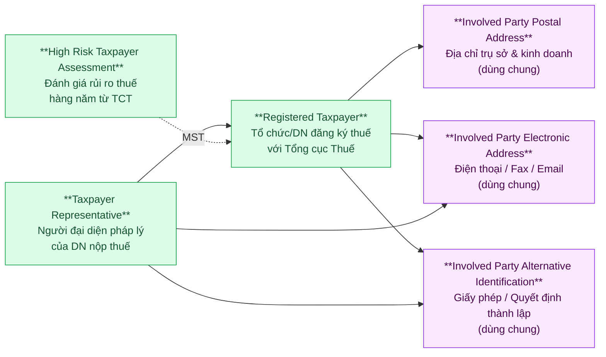
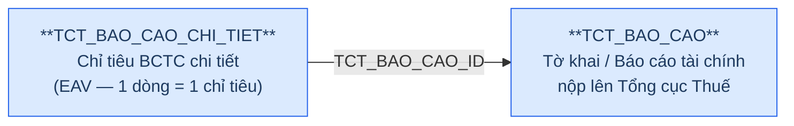
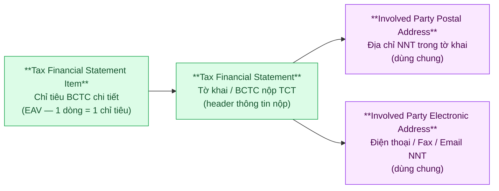
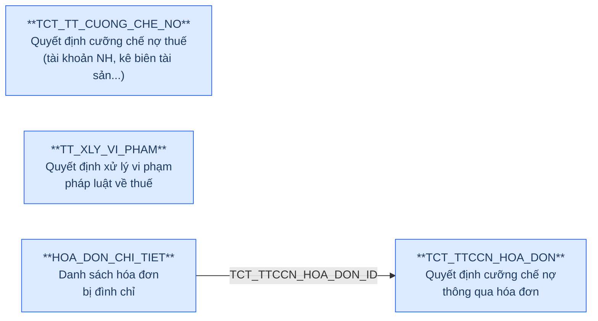
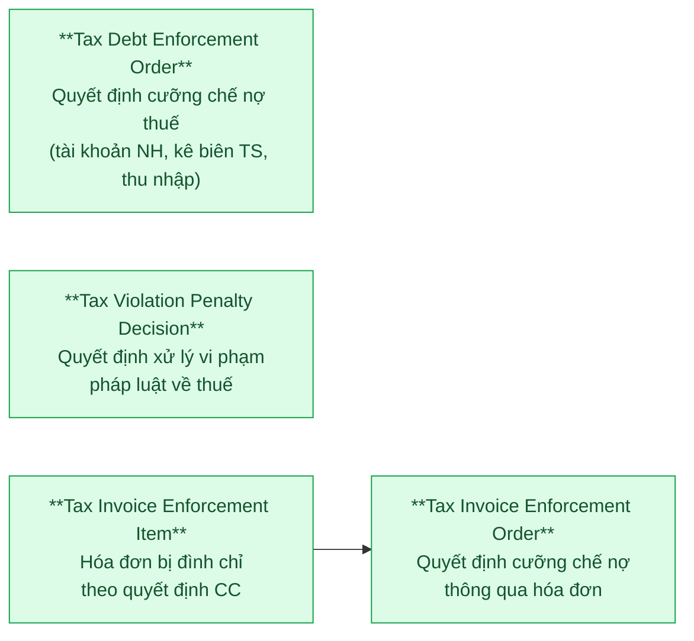

# DCST — Relationship Diagram: Source vs Silver Proposed Model

> **Hệ thống nguồn:** DCST (Dữ liệu Cơ quan Thuế — Tổng cục Thuế)
> **Domain:** Thông tin đăng ký thuế, báo cáo tài chính, cưỡng chế nợ thuế, xử lý vi phạm thuế
>
> **Render:** Mở file này trong VS Code với extension **Markdown Preview Mermaid Support**, hoặc dán từng block vào [mermaid.live](https://mermaid.live).
>
> **Ký hiệu:**
> - `──►` (mũi tên liền): quan hệ FK (Many → One)
> - `-.->` (mũi tên đứt): liên kết ngầm qua MST (không có FK khai báo)
> - 🔵 Xanh dương: bảng nguồn DCST
> - 🟢 Xanh lá: entity Silver / Proposed Model
> - 🟡 Vàng: bảng ngoài scope
> - 🟣 Tím: Shared entity (dùng chung cho mọi Involved Party)

---

## Nhóm 1 — Taxpayer Registration (Tổ chức/DN đăng ký thuế)

### Source (DCST)

> **Không có FK khai báo** giữa các bảng trong source. Liên kết thực tế:
> - `TTKDT_NGUOI_DAI_DIEN.THONG_TIN_DK_THUE_ID` → FK thực đến `THONG_TIN_DK_THUE.ID`
> - `DN_RUI_RO_CAO.MA_SO_DOANH_NGHIEP` ↔ `THONG_TIN_DK_THUE.MA_SO_THUE` (liên kết ngầm qua MST)

```mermaid
graph LR
    classDef src fill:#dbeafe,stroke:#2563eb,color:#1e3a5f

    THUE["**THONG_TIN_DK_THUE**\nThông tin đăng ký thuế\ncủa tổ chức/DN nộp thuế"]:::src
    NGUOIDAIDIEN["**TTKDT_NGUOI_DAI_DIEN**\nNgười đại diện của\ntổ chức/DN nộp thuế"]:::src
    RUIRO["**DN_RUI_RO_CAO**\nDoanh nghiệp rủi ro cao\n(đánh giá hàng năm)"]:::src

    NGUOIDAIDIEN -->|THONG_TIN_DK_THUE_ID| THUE
    RUIRO -.->|MST = MA_SO_THUE\n(liên kết ngầm)| THUE
```

### Silver — Proposed Model



> **Shared Entities (tím):** `Involved Party Postal Address`, `Involved Party Electronic Address`, `Involved Party Alternative Identification` — dùng chung.
>
> **Liên kết ngầm MST:** `High Risk Taxpayer Assessment.Organization Tax Identification Number` → ETL JOIN với `Registered Taxpayer.Organization Tax Identification Number` để resolve FK.
>
> **Hai loại địa chỉ trong THONG_TIN_DK_THUE:** `DIA_CHI_TSC` (trụ sở chính) + `MOTA_DIACHI_KD`+mã tỉnh/huyện/xã (kinh doanh) → 2 dòng trong `Involved Party Postal Address` với Address Type = HEAD_OFFICE / BUSINESS.

---

## Nhóm 2 — Tax Financial Statement (Tờ khai / Báo cáo tài chính thuế)

### Source (DCST)



### Silver — Proposed Model



> **Địa chỉ trong TCT_BAO_CAO** là snapshot tại thời điểm nộp tờ khai — load vào `Involved Party Postal Address` với timestamp của tờ khai.
>
> **EAV pattern (TCT_BAO_CAO_CHI_TIET):** Nhiều cột số liệu (SO_CUOI_NAM, SO_DAU_NAM, NAM_NAY...) là các chiều giá trị khác nhau của cùng 1 chỉ tiêu — giữ nguyên dạng wide table trong Silver, không pivot thành narrow EAV.

---

## Nhóm 3 — Tax Enforcement & Violation (Cưỡng chế nợ & xử lý vi phạm thuế)

### Source (DCST)



> **Không có FK** giữa `TCT_TT_CUONG_CHE_NO`, `TT_XLY_VI_PHAM` và `TCT_TTCCN_HOA_DON`. Các bảng này liên kết ngầm qua `MA_NNHAN`/`MST` (mã số thuế đối tượng bị xử lý).

### Silver — Proposed Model



> **Liên kết với Tax Registration:** `TDEO.Taxpayer Tax Number`, `TVPD.Organization Tax Identification Number`, `TIEO.Taxpayer Tax Number` đều liên kết ngầm với `Registered Taxpayer.Organization Tax Identification Number` qua MST — ETL JOIN để resolve.

---

## Tổng quan theo BCV Concept

| BCV Concept | Source Tables | Silver Entities |
|---|---|---|
| **[Involved Party] — Organization** | THONG_TIN_DK_THUE | Registered Taxpayer |
| **[Involved Party] — Involved Party** | TTKDT_NGUOI_DAI_DIEN | Taxpayer Representative |
| **[Involved Party] — Organization** | DN_RUI_RO_CAO | High Risk Taxpayer Assessment |
| **[Documentation] — Regulatory Report** | TCT_BAO_CAO | Tax Financial Statement |
| **[Documentation] — Reported Information** | TCT_BAO_CAO_CHI_TIET | Tax Financial Statement Item |
| **[Documentation] — Regulatory Report** | TCT_TT_CUONG_CHE_NO | Tax Debt Enforcement Order |
| **[Business Activity] — Conduct Violation** | TT_XLY_VI_PHAM | Tax Violation Penalty Decision |
| **[Documentation] — Invoice** | TCT_TTCCN_HOA_DON | Tax Invoice Enforcement Order |
| **[Documentation] — Invoice** | HOA_DON_CHI_TIET | Tax Invoice Enforcement Item |
| **[Location] — Postal Address** *(shared)* | THONG_TIN_DK_THUE, TCT_BAO_CAO | Involved Party Postal Address |
| **[Location] — Electronic Address** *(shared)* | THONG_TIN_DK_THUE, TTKDT_NGUOI_DAI_DIEN, TCT_BAO_CAO | Involved Party Electronic Address |
| **[Involved Party] — Alternative Identification** *(shared)* | THONG_TIN_DK_THUE (GPKD, QĐ thành lập), TTKDT_NGUOI_DAI_DIEN (CMND/CCCD/Hộ chiếu) | Involved Party Alternative Identification |
